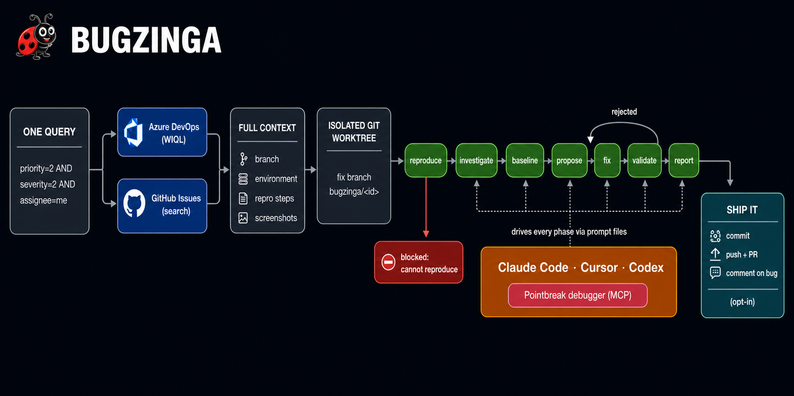

<div align="center">

# 🐞 BUGZINGA

### *"That bug never stood a chance."*


<sub>© CBS · <a href="https://giphy.com/gifs/cbs-big-bang-theory-sheldon-cooper-bazinga-eK0qDH7ody271VXs8P">via GIPHY</a></sub>

<br>
<br>

**Autonomous bug fixing while you work on something else.**<br>
Query your tracker → import full bug context → *reproduce first* → investigate with a real debugger →<br>propose → fix → validate → report. Reviewed branch, zero babysitting.

<sub>*Bazinga* is what Sheldon Cooper says when he's got you. **Bugzinga** is what your backlog hears.</sub>

<br>


<br>

[Why](#why-bugzinga) · [How it works](#how-it-works) · [Quick start](#quick-start) · [Commands](#commands) · [Query DSL](#the-query-dsl) · [Configuration](#configuration) · [Agents](#coding-agents) · [Pointbreak](#debugging-with-pointbreak) · [Workspace](#the-workspace) · [Security](#security) · [Troubleshooting](#troubleshooting)

</div>

---

## Why Bugzinga

You have a backlog of P2/S2 bugs and better things to do. Bugzinga turns *"assigned to me"* into *"fixed, validated, and waiting for review"*:

| | |
|---|---|
| **One query, full context** | `priority=2 AND severity=2 AND assignee=me`, compiled to WIQL (Azure DevOps) or search qualifiers (GitHub). Each bug arrives with the **branch it was produced on**, the **environment**, **repro steps**, **screenshots**, and recent comments. |
| **Reproduce-first, always** | Nothing gets "fixed" until the failure is observed and made repeatable, ideally as a failing test that ships with the fix as its regression test. Can't reproduce? The bug is **blocked**, not hallucinated away. |
| **Real debugging** | Via [Pointbreak](https://github.com/withpointbreak/pointbreak-claude): breakpoints, step-through, variable inspection. Agents have to quote the values they actually saw. |
| **Any coding agent** | Claude Code, Cursor, or Codex: same pipeline, same artifact contracts. Switch with `--agent`. |
| **Machine-checked verdicts** | Every phase must end its artifact with `BUGZINGA_VERDICT:`. The runner parses that line mechanically, retries with feedback when it's missing, and loops validate→fix on rejection. An agent *saying* "done" is worth nothing here. |
| **Walk-away safe** | Isolated per-bug git worktrees, crash-resumable state, timeouts with process-tree kill, env-only tokens redacted everywhere, delivery off by default. |

Bugzinga grew out of the **`/fix-bug` Claude skill pipeline** (investigate → build-baseline → fix → report, with its KISS discipline, 5-attempt loop, and zero-new-warnings rule). It packages that pipeline for any agent and adds the reproduce, propose, and validate phases. [The two compose →](#relationship-to-the-fix-bug-claude-skills)

---

## How it works



| # | Phase | What happens | Artifact | Verdicts |
|---|-------|--------------|----------|----------|
| 1 | **reproduce** | Match the bug's environment, follow the repro steps (and *look at* the screenshots), trigger the failure, make it repeatable (preferably a failing test) | `repro.md` | `reproduced` / `not-reproduced` |
| 2 | **investigate** | Trace to root cause with debugger evidence; affected files; what the fix must check; regression risks | `issue.md` | `complete` |
| 3 | **baseline** | Run the build, record every warning/error: the regression yardstick | `existing-warnings.md` | `complete` / `build-broken` |
| 4 | **propose** | Design the *minimal* fix (KISS), alternatives rejected, validation plan, blast radius | `proposal.md` | `ready` |
| 5 | **fix** | Implement → build → re-run repro → evaluate, up to 5 attempts; zero new warnings allowed | `fix-attempts.md` | `fixed` / `failed` |
| 6 | **validate** | Adversarial re-verification: repro re-run, build vs baseline, test suite, blast-radius probes, diff review. Rejection loops back to **fix** | `validation.md` | `validated` / `not-fixed` / `regression` |
| 7 | **report** | Before/after change log for the human reviewer | `what-was-done.md` | `complete` |

The runner is the deterministic harness around the nondeterministic agent: it renders each phase's instructions to a prompt file, enforces timeouts, verifies artifact + verdict, archives stale artifacts before retries, and persists `state.json` after every transition, so **a crash, reboot, or Ctrl+C is always resumable.**

---

## Quick start

```powershell
# 1 · Install from source (Node 20+ and git required; npm package coming)
git clone https://github.com/<you>/bugzinga
cd bugzinga
npm install
npm run build
npm link                               # puts `bugzinga` on your PATH

# 2 · Configure (in your repo, or anywhere)
bugzinga init --tracker azure          # or --tracker github

# 3 · Token (env-only, never in config)
$env:BUGZINGA_ADO_PAT = "<pat>"        # Azure DevOps: Work Items R&W + Code R&W
# $env:BUGZINGA_GITHUB_TOKEN = "<token>"   # GitHub: repo scope

# 4 · Verify the rig
bugzinga doctor

# 5 · Peek before you unleash
bugzinga hunt "priority=2 AND severity=2 AND assignee=me" --dry-run

# 6 · Unleash. Go get coffee. Or write a paper on string theory.
bugzinga hunt "priority=2 AND severity=2 AND assignee=me" --max 5

# 7 · Come back and review
bugzinga status
bugzinga report 48213
```

A successful hunt ends like this:

```text
ID     Outcome   Pipeline  Detail
─────  ────────  ────────  ─────────────────────────────────────────
48213  fixed ✔   ✔✔✔✔✔✔✔   branch bugzinga/48213
48217  fixed ✔   ✔✔✔✔✔✔✔   https://dev.azure.com/...pullrequest/991

BUGZINGA! 2 bug(s) down. Review with: bugzinga report <id>
```

<sub>The PR link on row two appears when `delivery.createPr` is enabled; pushing, PRs, and tracker comments all ship off by default.</sub>

---

## Commands

| Command | What it does |
|---|---|
| `bugzinga init [--tracker azure\|github]` | Scaffold `bugzinga.config.json` |
| `bugzinga doctor` | Verify node · git · config · tokens · agents · Pointbreak |
| `bugzinga hunt [query]` | Query → import → run the full pipeline on every match |
| `bugzinga import [query] [--id <id>]` | Import bugs + context only (no fixing) |
| `bugzinga fix <bugId>` | Pipeline for one bug · `--from-phase` · `--skip` · `--offline` |
| `bugzinga status [--json]` | Live state of every bug workspace |
| `bugzinga report <bugId> [--artifact <phase>]` | Print the final report (or any phase artifact) |

**Power flags** on `hunt` / `fix`: `--agent claude|cursor|codex` · `--autonomy edits|full` · `--model <m>` · `--concurrency <n>` · `--max <n>` · `--dry-run` · `--from-phase <phase>` · `--skip <phases>`

---

## The query DSL

One small language. Azure DevOps gets **WIQL**, GitHub gets **search qualifiers**:

```text
priority=2 AND severity=2 AND assignee=me
(priority=1 OR priority=2) AND state=Active AND tag=regression
severity<=2 AND area="Platform\Storage" AND title~"timeout"
id=48213
```

| Field | Ops | Azure DevOps | GitHub |
|---|---|---|---|
| `priority` | `= != < <= > >=` | `Microsoft.VSTS.Common.Priority` | label (`labels.priority` format, `=`/`!=`) |
| `severity` | `= != < <= > >= ~` | `2` ⇒ `'2 - High'`, ranges ⇒ `IN (...)` | label (`labels.severity` format, `=`/`!=`) |
| `assignee` | `= !=` | `me` ⇒ `@Me` | `@me` / username / `unassigned` |
| `state` | `= != ~` | `System.State` | `open`/`closed` (`active` ⇒ `open`) |
| `tag` / `label` | `= != ~` | `System.Tags CONTAINS` | `label:` |
| `title` | `= ~` | exact / `CONTAINS` | `"..." in:title` |
| `area` | `= !=` | `System.AreaPath UNDER` | n/a (ADO only) |
| `iteration` / `sprint` | `= !=` | `UNDER` · `current` ⇒ `@CurrentIteration` | n/a (ADO only) |
| `id` | `=` | direct fetch | direct fetch |

> **Honest by design:** GitHub search can't express `OR`, so Bugzinga refuses loudly instead of returning the wrong bug set. Unless your query mentions `state`, terminal states (Closed/Done/Removed/Resolved) are excluded automatically. Aliases: `pri`, `sev`, `assignedTo`, `label`, `status`, `sprint`.

---

## Configuration

Minimal `bugzinga.config.json` (found in cwd, any parent, or `~/.bugzinga/config.json`):

```json
{
  "tracker": { "kind": "azure", "organization": "acme", "project": "Rocket", "repository": "rocket" },
  "build":   { "command": "dotnet build", "testCommand": "dotnet test" },
  "defaultQuery": "priority=2 AND severity=2 AND assignee=me"
}
```

<details>
<summary><b>Full annotated reference: every option, every default</b></summary>
<br>

```jsonc
{
  "tracker": {
    "kind": "azure",                  // or "github"
    "organization": "your-org",       // azure: org
    "project": "Your Project",        // azure: project
    "repository": "your-repo"         // azure: repo (enables clone-URL derivation + PRs)
    // github instead: "owner": "...", "repo": "...",
    //   "labels": { "priority": "priority:{n}", "severity": "severity:{n}" }
  },
  "repo": {
    "url": null,                      // optional; derived from tracker when possible
    "defaultBranch": "main",
    "root": "~/.bugzinga"             // clones + worktrees live here
  },
  "agent": {
    "kind": "claude",                 // claude | cursor | codex
    "autonomy": "edits",              // edits | full (see Security)
    "model": null,                    // optional model override
    "extraArgs": []                   // appended verbatim to the agent CLI
  },
  "bugsRoot": "C:\\Bugs",             // workspace root (matches the fix-bug skills)
  "build": {
    "command": "npm run build",       // strongly recommended; otherwise agents discover it
    "testCommand": "npm test"
  },
  "pipeline": {
    "concurrency": 2,                 // bugs fixed in parallel (isolated worktrees)
    "maxFixAttempts": 5,              // the fix phase's internal loop
    "phaseAttempts": 2,               // runner retries when the artifact contract is broken
    "reproRequired": true,            // the repro-first gate
    "revalidateLoops": 1,             // validate→fix loops before giving up
    "skipPhases": [],                 // e.g. ["propose"] for small codebases
    "timeoutMinutes": { "reproduce": 30, "investigate": 20, "baseline": 15,
                        "propose": 15, "fix": 60, "validate": 30, "report": 10 }
  },
  "delivery": {
    "autoCommit": true,               // commit on bugzinga/<id> after validation
    "push": false,                    // push the fix branch
    "createPr": false,                // open a PR (auto-links AB#id / Fixes #id)
    "comment": false,                 // comment the outcome back on the bug
    "branchPrefix": "bugzinga/",
    "prTargetBranch": null            // default: the branch the fix was based on
  },
  "debugging": {
    "enabled": true,
    "mcp": null                       // e.g. { "name": "pointbreak", "command": "pointbreak", "args": ["mcp"] }
  },
  "defaultQuery": "priority=2 AND severity=2 AND assignee=me"
}
```

</details>

**Tokens come from the environment, never from the config file:**

| Tracker | Env vars (first match wins) | Scopes |
|---|---|---|
| Azure DevOps | `BUGZINGA_ADO_PAT` · `AZURE_DEVOPS_EXT_PAT` · `ADO_PAT` | Work Items (R&W) · Code (R&W for push/PR) |
| GitHub | `BUGZINGA_GITHUB_TOKEN` · `GITHUB_TOKEN` · `GH_TOKEN` | `repo` (or fine-grained: Issues RW · Contents R · PRs W) |

Git clone/push auth uses your normal **git credential manager**; tokens never appear in URLs, and every registered secret is redacted from logs, transcripts, and error messages (URL-encoded forms included).

---

## Coding agents

| | Claude Code | Cursor | Codex |
|---|---|---|---|
| Binary | `claude` | `cursor-agent` | `codex` |
| Invocation | `claude -p` | `cursor-agent -p --force` | `codex exec` |
| `autonomy: "edits"` | `--permission-mode acceptEdits` + tool allowlist | `--force` (no granular tiers) | `--full-auto` (workspace-write sandbox) |
| `autonomy: "full"` | `--dangerously-skip-permissions` | `--force` | `--dangerously-bypass-approvals-and-sandbox` |
| Pointbreak wiring | plugin or `--mcp-config` *(automatic)* | `~/.cursor/mcp.json` *(manual; doctor checks)* | `-c mcp_servers.*` *(automatic)* |

Every phase's full instructions are written to a **prompt file** (`logs/phase-N-<phase>.prompt.md`) and the agent is pointed at it. The instructions stay auditable and diffable, and the command line never hits Windows length limits. Full transcripts land beside them.

---

## Debugging with Pointbreak

Bugzinga's reproduce / investigate / fix prompts demand **evidence over speculation**: breakpoints at function entries, error-handling blocks, return statements and conditional branches; step-through along the repro path; variable inspection. The values an agent saw go into the artifact, quoted.

For Claude Code, install the [Pointbreak plugin](https://github.com/withpointbreak/pointbreak-claude):

```text
/plugin marketplace add withpointbreak/pointbreak-claude
/plugin install pointbreak@pointbreak-claude
```

*(Pointbreak itself: [docs.withpointbreak.com](https://docs.withpointbreak.com/installation).)* Or set `debugging.mcp` in the config and Bugzinga passes the server to Claude (`--mcp-config`) and Codex (`-c`) automatically; for Cursor add it to `~/.cursor/mcp.json`. `bugzinga doctor` reports what it detects. No debugger? Agents fall back to disciplined instrumentation, and are told to clean it up.

---

## The workspace

```text
C:\Bugs\48213\
├── bug.md                  ← the imported bug: metadata, description, repro steps,
├── bug.json                  environment, branch, comments (agents read this first)
├── screenshots\            ← downloaded attachments (agents *look* at these)
├── repro.md                ← 1 · how the failure was reproduced (+ failing test)
├── issue.md                ← 2 · root cause with debugger evidence
├── existing-warnings.md    ← 3 · build baseline for regression comparison
├── proposal.md             ← 4 · the designed fix + blast radius
├── fix-attempts.md         ← 5 · attempt log (≤ maxFixAttempts)
├── validation.md           ← 6 · adversarial re-verification
├── what-was-done.md        ← 7 · final before/after report
├── fix-failed.md           ← only when the fix phase gave up
├── state.json              ← resumable pipeline state
└── logs\                   ← rendered prompts + full agent transcripts
```

### Relationship to the fix-bug Claude skills

Bugzinga is the productized, agent-agnostic evolution of the `/fix-bug` skill pipeline (`bug-investigator` → `build-verifier` → `bug-fixer` → `bug-reporter`). Same workspace root, same artifact contracts, same KISS principle, plus **reproduce**, **propose**, **validate**, and delivery. They compose both ways:

- `bugzinga import --id 48213` → run `/fix-bug 48213` in Claude Code yourself.
- Workspaces produced by either are readable by the other.

---

## Security

- **Autonomy is a dial.** `edits` (the default) keeps agents inside guarded modes; `full` removes guardrails for true unattended runs, so opt in deliberately. (Cursor's CLI only has `--force`.)
- **Tokens:** env-only · redacted from all output · never in clone URLs · attachment SAS query strings stripped from errors.
- **Delivery is opt-in.** Agents are instructed never to commit or push; Bugzinga performs delivery deterministically, and `push` / `createPr` / `comment` ship **off**.

<details>
<summary><b>Full reliability model: why you can actually walk away</b></summary>
<br>

- **Repro-first gate:** unreproduced bugs are *blocked*, outcome `cannot-reproduce`, optionally commented back to the tracker asking for better steps.
- **Machine-checked verdicts:** missing/invalid artifact ⇒ retry with explicit feedback ⇒ honest failure with the transcript on disk.
- **Stale-artifact protection:** artifacts are archived before any re-run so an old verdict can never masquerade as a new result.
- **Regression baseline:** zero new build warnings/errors vs `existing-warnings.md`; validation re-runs everything independently and adversarially.
- **Isolated worktrees:** each bug gets its own checkout + `bugzinga/<id>` branch off *the branch the bug was produced on*; your working copy is never touched.
- **Resumable everything:** `state.json` after every transition; re-running continues where it stopped; `--from-phase` restarts surgically.
- **Timeouts + process-tree kill:** a hung agent (or its grandchildren) can't wedge the pipeline.
- **Failure isolation:** one bug crashing never takes down the batch; exit codes reflect reality.

</details>

---

## Troubleshooting

<details>
<summary><b>Common symptoms and fixes</b></summary>
<br>

| Symptom | Fix |
|---|---|
| `No Azure DevOps PAT found` | Set `BUGZINGA_ADO_PAT` (new shells don't inherit old `$env:` assignments) |
| ADO returns a sign-in page / 203 | PAT expired or missing scopes; regenerate it |
| `claude not found on PATH` | `npm i -g @anthropic-ai/claude-code`, run `claude` once to sign in, then `bugzinga doctor` |
| Clone hangs then fails | Bugzinga sets `GIT_TERMINAL_PROMPT=0`; configure Git Credential Manager for your host first |
| GitHub query returns nothing | Check `labels.priority` / `labels.severity` formats (e.g. `"P{n}"`) match the repo's labels |
| Phase keeps timing out | Raise `pipeline.timeoutMinutes.<phase>`; read the transcript in `logs/` |
| Want to watch it work | `bugzinga --verbose hunt ...` and tail `C:\Bugs\<id>\logs\phase-*.log` |

</details>

---

## Development

```powershell
npm install
npm run build     # tsc + copy prompt templates
npm test          # vitest, includes a real-git end-to-end pipeline test
npm run lint
```

<details>
<summary><b>Architecture & data flow</b></summary>
<br>

Ports-and-adapters around a deterministic pipeline core. Adding a tracker (Jira?) or an agent means **one new adapter file, zero core changes**:

```text
src/
├── query/        DSL: AST · recursive-descent parser · WIQL + GitHub compilers
├── trackers/     BugTracker port · Azure DevOps + GitHub adapters → normalized Bug
├── agents/       CodingAgent port · Claude Code / Cursor / Codex adapters
├── prompts/      phase templates + partials ({{VAR}} substitution, throws on holes)
├── pipeline/     workspace · state machine · runner (verdict enforcement) · orchestrator
├── repo/         shared clone + per-bug worktrees
├── cli/          commander wiring (commands stay thin)
└── util/         exec (Windows .cmd-safe) · http (retry/backoff) · redact · logger
```

See [CONTRIBUTING.md](CONTRIBUTING.md) for the rules of the road.

</details>

---

<div align="center">

**[MIT](LICENSE)** © Sunny Shaban

Built on the shoulders of the `/fix-bug` skill pipeline and [Pointbreak](https://github.com/withpointbreak/pointbreak-claude).

🐞 *I'm not crazy; my bugs are reproduced, my fixes are validated, and my mother had me tested.* 🐞

**BUGZINGA!**

</div>
